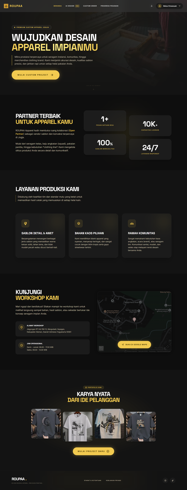
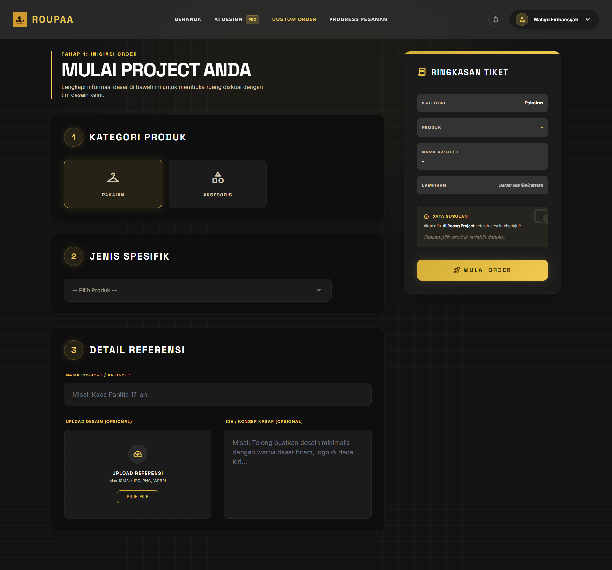
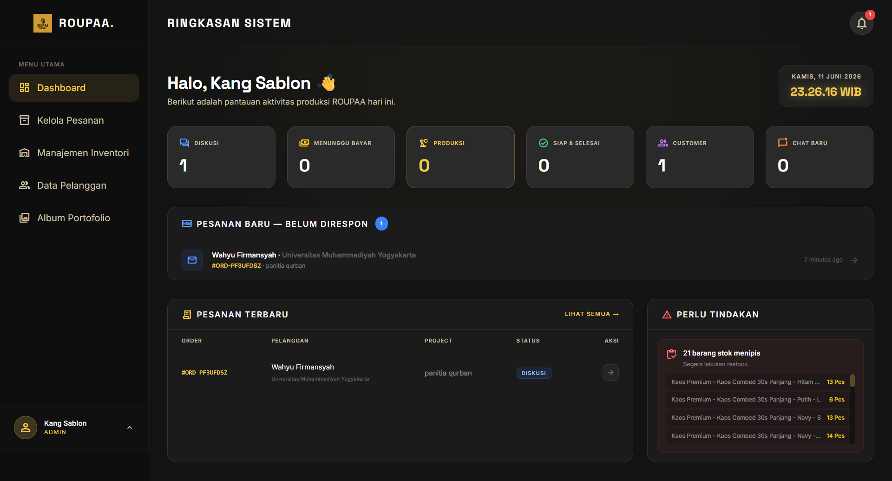
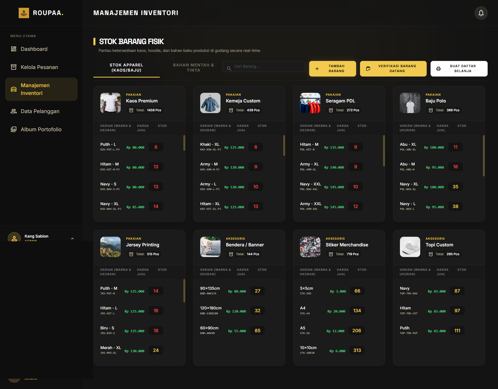

# Roupaa Apparel

**Custom apparel ordering and production management web application**

Roupaa Apparel adalah aplikasi web untuk menghubungkan pelanggan yang ingin memesan apparel custom dengan tim operasional produksi. Pelanggan dapat mengajukan pesanan, berdiskusi tentang desain, memantau progres, dan melakukan pembayaran. Admin mengelola pesanan, pelanggan, portofolio, serta inventaris; owner dapat mengelola admin dan melihat laporan operasional serta keuangan.

## Fitur utama

### Pelanggan
- Registrasi, login, reset kata sandi, dan pengelolaan profil.
- Membuat pesanan apparel custom beserta spesifikasi produk.
- Melihat riwayat dan perkembangan pesanan.
- Meninjau serta menyetujui desain/mockup pesanan.
- Chat terkait pesanan dengan tim operasional, termasuk penanda pesan dibaca.
- Pembayaran pesanan melalui integrasi Midtrans Snap dan pembaruan status pembayaran.
- Menerima notifikasi terkait pesanan.
- Menggunakan **AI Studio** untuk menghasilkan ide/desain apparel dan melihat riwayat hasilnya; fitur ini menggunakan OpenAI API dan membutuhkan API key.

### Admin / Tim Operasional
- Dashboard operasional dan daftar pesanan.
- Mengelola proses pesanan, termasuk mengunggah atau merevisi mockup, menentukan harga akhir, serta memperbarui status produksi dan pengiriman.
- Mengelola data pelanggan dan portofolio hasil produksi.
- Mengelola stok apparel, bahan baku, dan proses restock.
- Berkomunikasi dengan pelanggan melalui chat pesanan dan menerima notifikasi.

### Owner
- Melihat laporan pesanan, pendapatan, pengeluaran restock, dan saldo bersih berdasarkan periode.
- Mengelola akun admin.

## Teknologi

| Bagian | Teknologi |
| --- | --- |
| Backend | PHP 8.3+, Laravel 13, Eloquent ORM |
| Frontend | Laravel Blade, JavaScript, Tailwind CSS 4, Vite |
| Database | MySQL (konfigurasi aplikasi juga menyediakan SQLite) |
| Autentikasi & akses | JWT Authentication, role-based access control: pelanggan, admin, owner |
| Realtime | Laravel Reverb, Laravel Echo |
| Pembayaran | Midtrans Snap |
| AI Studio | OpenAI API |
| Lainnya | Laravel DOMPDF, Composer, npm |

## Alur aplikasi

1. Pelanggan membuat akun, memilih kebutuhan apparel, dan mengirim pesanan custom.
2. Tim operasional meninjau pesanan, menyiapkan mockup, dan berkomunikasi dengan pelanggan.
3. Pelanggan meninjau atau menyetujui desain dan mengikuti proses pembayaran.
4. Admin memperbarui status pesanan, produksi, dan pengiriman sambil mengelola inventaris.
5. Owner melihat ringkasan transaksi serta laporan pendapatan dan pengeluaran.

## Screenshot

### Homepage



### Custom Apparel Order



### Admin Dashboard



### inventory Management



## Menjalankan secara lokal

**Persyaratan:** PHP 8.3+, Composer, Node.js dan npm, serta MySQL atau SQLite. Untuk fitur chat realtime, pembayaran, dan AI Studio, diperlukan konfigurasi layanan terkait.

```bash
# 1. Clone repository
git clone https://github.com/Kurwhy/roupaa_apparel_final.git
cd roupaa_apparel_final

# 2. Instal dependensi
composer install
npm install

# 3. Siapkan konfigurasi lokal
cp .env.example .env
php artisan key:generate
```

Sesuaikan pengaturan `DB_CONNECTION` dan konfigurasi database di `.env`, lalu jalankan:

```bash
php artisan migrate
php artisan storage:link
```

Siapkan aset frontend dan server aplikasi pada dua terminal:

```bash
npm run dev
```

```bash
php artisan serve
```

Buka alamat lokal yang ditampilkan oleh `php artisan serve` (umumnya `http://127.0.0.1:8000`). Untuk membuat akun pengujian dengan seeder, **periksa dan ganti terlebih dahulu data contoh serta kredensial dalam `database/seeders/`** sebelum menjalankan `php artisan db:seed`.

### Integrasi opsional

- **Midtrans:** Atur `MIDTRANS_SERVER_KEY`, `MIDTRANS_CLIENT_KEY`, dan `MIDTRANS_IS_PRODUCTION` pada `.env`. Untuk pembayaran nyata, konfigurasikan endpoint notifikasi/webhook sesuai dokumentasi Midtrans dan pastikan server dapat menerima callback.
- **AI Studio:** Atur `OPENAI_API_KEY` pada `.env`; penggunaan API dapat menimbulkan biaya.
- **Realtime chat:** Atur koneksi broadcasting/Reverb yang dibutuhkan pada `.env` dan jalankan server dengan `php artisan reverb:start`. Sesuaikan juga konfigurasi klien realtime pada frontend.

## Struktur folder

```text
app/
  Http/Controllers/    # Auth, pelanggan, pesanan, pembayaran, admin, owner
  Models/              # Model pengguna, produk, pesanan, stok, dan lainnya
  Events/              # Event notifikasi / chat
resources/
  views/               # Halaman Blade untuk pelanggan, admin, owner
  js/                  # JavaScript frontend
routes/web.php         # Route halaman dan endpoint aplikasi
database/migrations/   # Skema database
database/seeders/      # Data contoh (periksa sebelum digunakan)
public/                # Aset publik
```

## Developer

**Wahyu Firmansyah**

Informatics Student | Full-Stack Web Developer

GitHub: [@Kurwhy](https://github.com/Kurwhy)

---